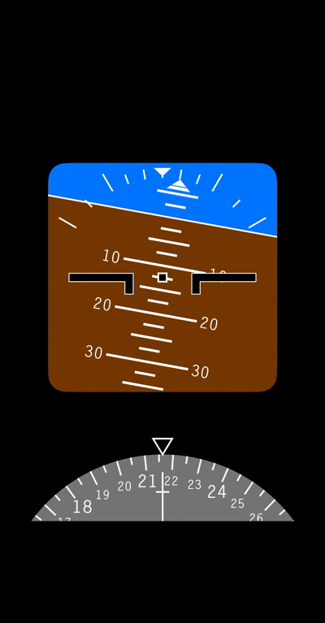

# ✈️ SwiftUI PFD Simulator

A realistic **Primary Flight Display (PFD)** simulator built entirely with SwiftUI. This app replicates the core instruments found in modern aircraft cockpits, using real device motion data to simulate pitch, roll, and heading.


---

## 🎯 Features

### Attitude Indicator
- **Sky & Terrain** - Dynamic blue sky and brown terrain with smooth transitions
- **Pitch Ladder** - Graduated pitch lines at 2.5°, 5°, and 10° intervals
- **Horizon Line** - Clear white horizon reference

### Bank Angle Indicator
- **Scale Ticks** - Markings at 0°, 10°, 20°, 30°, 45°, and 60°
- **Rotating Pointer** - Real-time bank angle indication with split-triangle design
- **Fixed Reference Triangle** - Static top marker for reference

### Heading Indicator (HSI)
- **Magnetic Heading** - Uses device magnetometer for real compass heading
- **Rotating Compass Rose** - Degree markings with dynamic text labels
- **Fixed Lubber Line** - Center pointer with top triangle marker

### Aircraft Symbol
- **Center Reference** - Fixed aircraft wings symbol
- **Center Marker** - Black square with white border at horizon center

---

## 📱 Animation



---

## 🏗️ Architecture

```
PFDSimulator/
├── Engine/
│   ├── Constants.swift      # Layout constants and calculations
│   └── Motion.swift         # CoreMotion data provider
├── Layers/
│   ├── AttitudeIndicator.swift
│   ├── PitchLadder.swift
│   ├── AircraftSymbol.swift
│   ├── BankAngleScale.swift
│   ├── BankAnglePointer.swift
│   └── HSI.swift
├── Views/
│   ├── PFDView.swift        # Main container view
│   ├── RotatingContentView.swift
│   ├── StaticContentView.swift
│   ├── BankAnglePointerView.swift
│   └── HSIContentView.swift
└── Protocol/
    └── PFDLayer.swift       # Common drawing protocol
```

---

## 🔧 Technical Details

- **Framework:** SwiftUI with Canvas API for custom graphics
- **Motion Data:** CoreMotion for device attitude and heading
- **Orientation:** Portrait-only for optimal display
- **Custom Font:** LetterGothicStd-Bold for authentic cockpit aesthetics

### Motion Limits
| Parameter | Min | Max |
|-----------|-----|-----|
| Pitch | -20° | +30° |
| Roll | -25° | +25° |
| Heading | 0° | 360° |

---

## 📋 Requirements

- iOS 17.0+
- Xcode 15.0+
- Physical device (motion sensors required)

---

## 🚀 Getting Started

1. Clone the repository:
   ```bash
   git clone https://github.com/efedoganay/swiftui-pfd-simulator.git
   ```

2. Open in Xcode:
   ```bash
   cd swiftui-pfd-simulator
   open PFDSimulator.xcodeproj
   ```

3. Build and run on a physical iOS device

---

## 📄 License

This project is available under the MIT License.

---

## 👨‍💻 Author

**Fikret Efe Doğanay**
